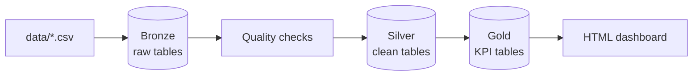

# Mini Data Platform — E-Commerce ETL Pipeline

A learning and portfolio project that implements a **Bronze → Silver → Gold** data pipeline for a fictional e-commerce store. Built following a hands-on junior Data/ETL developer roadmap.

**Stack:** Python 3.10+ · PostgreSQL 17 · PySpark 3.5 · psycopg2 · python-dotenv · Docker (optional)

---

## Quick start — one command (Docker)

**Same command on Windows, macOS, and Linux** — only [Docker Desktop](https://www.docker.com/products/docker-desktop/) (or Docker Engine) required:

```bash
docker compose up --build
```

When the pipeline container finishes, open **`reports/latest_dashboard.html`** on your machine (the `reports/` folder is mounted from the project).

This automatically:

1. Starts PostgreSQL 17 and creates all databases + tables (Bronze, Silver, Gold)
2. Generates CSV test data
3. Runs the full ETL pipeline
4. Writes the dashboard to `reports/latest_dashboard.html`

No `.env`, no local Python/Java/PostgreSQL install, no manual SQL.

**Reset everything (fresh databases):**

```bash
docker compose down -v
docker compose up --build
```

> Demo DB password inside Docker: `mini_etl_demo` (local use only).

For manual setup without Docker, see [Setup](#setup) below.

**Windows — one command without Docker** (PostgreSQL + Python already installed):

```powershell
.\scripts\run_all.ps1
```

Creates DBs, runs DDL, generates CSV, runs the full pipeline. Requires `.env` with your real `PGPASSWORD`.

---

## What this project does

Raw CSV files (customers, products, orders, payments, shipments) are ingested into PostgreSQL, cleaned with business rules, and aggregated into KPI tables for reporting.



| Layer | Database | Purpose |
|-------|----------|---------|
| **Bronze** | `ecommerce_bronze` | Raw data as-is from CSV (including bad rows) |
| **Silver** | `ecommerce_silver` | Cleaned, validated, deduplicated data |
| **Gold** | `ecommerce_gold` | Business metrics (revenue, customer KPIs) |

---

## Features

- **Bronze ingest** — 5 CSV sources; orders ingested with **PySpark**
- **Bronze quality checks** — duplicate emails, negative prices, invalid quantity (SQL + Python)
- **Silver v2 transforms** — trim, dedupe, email normalization, FK validation, company vs individual rules
- **Rejected records** — bad rows stored in `silver.rejected_records` with reason codes
- **Gold KPIs** — daily sales and per-customer metrics
- **Pipeline orchestration** — `run_pipeline.py` runs the full flow end-to-end
- **Observability** — rotating logs, structured JSONL, metrics history, health checks, HTML dashboard, optional Slack alerts

---

## Project structure

```
mini-data-platform/
├── docker-compose.yml    # One command: docker compose up --build
├── Dockerfile            # Python + Java image for pipeline
├── docker/
│   ├── postgres/init/    # Auto-create DBs + schemas on first start
│   └── pipeline/         # Container entrypoint (CSV + run_pipeline)
├── .env.example          # Environment template (manual setup — gitignored .env)
├── data/                 # CSV source files (generate with generate_test_data.py)
├── jobs/
│   ├── ingest_*.py       # Bronze ingest scripts
│   ├── bronze_data_checks.py
│   ├── transform_*.py    # Silver & Gold transforms
│   ├── run_silver_v2.py
│   ├── setup_silver_v2.py
│   ├── run_pipeline.py   # Main entry point
│   ├── health_check.py
│   └── generate_test_data.py
├── scripts/
│   ├── load_env.sh       # Optional: load .env for psql in terminal (macOS / Linux)
│   ├── load_env.ps1      # Optional: load .env for psql in terminal (Windows)
│   └── push_to_github.ps1
├── sql/
│   ├── bronze_setup.sql
│   ├── bronze_add_customer_type.sql
│   ├── bronze_quality_checks.sql
│   ├── silver_v2_setup.sql
│   ├── gold_setup.sql
│   └── monitoring/
├── utils/
│   ├── db.py
│   ├── logging_config.py
│   ├── monitoring.py
│   └── transform_helpers.py
├── logs/                 # Runtime logs (gitignored)
└── reports/              # HTML dashboard (gitignored)
```

---

## Prerequisites

| Tool | Version | Why you need it |
|------|---------|-----------------|
| **Python** | 3.10+ | Ingest, transforms, pipeline orchestration |
| **PostgreSQL** | 17 (16+ works) | Three databases: bronze, silver, gold |
| **Java (JDK)** | 11 or 17 | Required by PySpark for `ingest_orders.py` |
| **Git** | any | Clone the repository |
| **psql** | bundled with Postgres | Create DBs and run SQL scripts from terminal |
| **pgAdmin / DBeaver** | optional | GUI alternative to `psql` |

> **Note:** CSV files in `data/` are not in git. After clone, run `generate_test_data.py` (see Setup step 5).

---

## Setup

### Step 0 — Install system dependencies

<details>
<summary><strong>macOS</strong> (Homebrew)</summary>

Install [Homebrew](https://brew.sh/) if needed, then:

```bash
# Core tools
brew install python@3.11 postgresql@17 openjdk@17 git

# Start PostgreSQL and enable on login
brew services start postgresql@17

# Add tools to PATH (Apple Silicon — adjust Intel path if needed)
echo 'export PATH="/opt/homebrew/opt/postgresql@17/bin:$PATH"' >> ~/.zshrc
echo 'export JAVA_HOME="$(/usr/libexec/java_home -v 17)"' >> ~/.zshrc
source ~/.zshrc
```

Verify:

```bash
python3 --version    # 3.10+
psql --version       # PostgreSQL 17.x
java -version        # openjdk 17.x
```

If `psql` is not found, run `brew link postgresql@17 --force` or use the full path from `brew info postgresql@17`.

</details>

<details>
<summary><strong>Linux</strong> (Debian / Ubuntu)</summary>

```bash
sudo apt update
sudo apt install -y python3 python3-pip python3-venv postgresql postgresql-contrib openjdk-17-jdk git
```

Start and enable PostgreSQL:

```bash
sudo systemctl start postgresql
sudo systemctl enable postgresql
```

Verify:

```bash
python3 --version
psql --version
java -version
```

**Fedora / RHEL:**

```bash
sudo dnf install -y python3 python3-pip postgresql-server postgresql-contrib java-17-openjdk git
sudo postgresql-setup --initdb
sudo systemctl start postgresql
sudo systemctl enable postgresql
```

</details>

<details>
<summary><strong>Windows</strong></summary>

- [Python 3.10+](https://www.python.org/downloads/)
- [PostgreSQL 17](https://www.postgresql.org/download/windows/) — include **pgAdmin** and **Command Line Tools**
- [Java 11 or 17](https://adoptium.net/) — set `JAVA_HOME` in Environment Variables
- Git for Windows

Ensure the PostgreSQL service is running (`postgresql-x64-17` in Services).

</details>

---

### Step 1 — Clone and Python environment

**macOS / Linux:**

```bash
git clone https://github.com/mersim334/mini-data-platform.git
cd mini-data-platform

python3 -m venv .venv
source .venv/bin/activate
pip install --upgrade pip
pip install -r requirements.txt
```

**Windows (PowerShell):**

```powershell
git clone https://github.com/mersim334/mini-data-platform.git
cd mini-data-platform
pip install -r requirements.txt
```

Test PySpark + Java (all platforms):

```bash
python -c "from pyspark.sql import SparkSession; SparkSession.builder.master('local[1]').getOrCreate().stop(); print('PySpark OK')"
```

If this fails with a Java error, fix `JAVA_HOME` before continuing.

---

### Step 2 — Create PostgreSQL databases

Each layer uses a **separate database** (not just a schema).

<details>
<summary><strong>macOS / Linux — terminal (recommended)</strong></summary>

On Linux, `psql` often connects as the `postgres` system user via peer auth:

```bash
# Linux (as postgres OS user)
sudo -u postgres psql

# macOS Homebrew (default superuser is often your macOS username)
psql postgres
```

Inside `psql`:

```sql
CREATE DATABASE ecommerce_bronze;
CREATE DATABASE ecommerce_silver;
CREATE DATABASE ecommerce_gold;
\q
```

One-liner without interactive shell:

```bash
# macOS / Linux — adjust -U if your superuser is not postgres
createdb ecommerce_bronze
createdb ecommerce_silver
createdb ecommerce_gold
```

</details>

<details>
<summary><strong>Windows — pgAdmin or psql</strong></summary>

In **pgAdmin**: right-click **Databases** → **Create** → **Database** for each name above.

Or in PowerShell (if `psql` is on PATH):

```powershell
& "C:\Program Files\PostgreSQL\17\bin\psql.exe" -U postgres -c "CREATE DATABASE ecommerce_bronze;"
& "C:\Program Files\PostgreSQL\17\bin\psql.exe" -U postgres -c "CREATE DATABASE ecommerce_silver;"
& "C:\Program Files\PostgreSQL\17\bin\psql.exe" -U postgres -c "CREATE DATABASE ecommerce_gold;"
```

</details>

---

### Step 3 — Run DDL scripts

Run each SQL file against the **correct database**. Scripts create schemas automatically (`bronze`, `silver`, `gold`).

<details>
<summary><strong>macOS / Linux — psql from project root</strong></summary>

```bash
cd mini-data-platform

# Replace -U postgres with your superuser if different
export PGPASSWORD='your_password'   # skip if peer/trust auth works locally

psql -U postgres -h localhost -d ecommerce_bronze -f sql/bronze_setup.sql
psql -U postgres -h localhost -d ecommerce_silver -f sql/silver_v2_setup.sql
psql -U postgres -h localhost -d ecommerce_gold   -f sql/gold_setup.sql
```

Optional — add `customer_type` column on bronze (needed for Silver v2 company rules):

```bash
psql -U postgres -h localhost -d ecommerce_bronze -f sql/bronze_add_customer_type.sql
```

Or run the combined Python helper (requires `.env` or exported `PGPASSWORD`):

```bash
python jobs/setup_silver_v2.py
```

</details>

<details>
<summary><strong>Windows — pgAdmin Query Tool</strong></summary>

| Script | Database |
|--------|----------|
| `sql/bronze_setup.sql` | `ecommerce_bronze` |
| `sql/silver_v2_setup.sql` | `ecommerce_silver` |
| `sql/gold_setup.sql` | `ecommerce_gold` |

Open Query Tool on the target database → paste script → Execute (F5).

</details>

**Verify schemas exist:**

```bash
psql -U postgres -d ecommerce_silver -c "\dn"
# Expected: bronze is NOT here — silver schema in ecommerce_silver
psql -U postgres -d ecommerce_silver -c "SELECT schema_name FROM information_schema.schemata WHERE schema_name = 'silver';"
```

---

### Step 4 — Configure environment variables

Connection settings are read from the environment. **`utils/db.py` loads `.env` automatically** when you run any Python script (via `python-dotenv`). Variables already set in your shell override `.env` values.

| Variable | Default | Description |
|----------|---------|-------------|
| `PGPASSWORD` | *(required)* | PostgreSQL password |
| `PGHOST` | `localhost` | Database host |
| `PGPORT` | `5432` | Database port |
| `PGUSER` | `postgres` | Database user |
| `PGDATABASE` | `ecommerce_bronze` | Default DB for ingest scripts |
| `SLACK_WEBHOOK_URL` | optional | Alert on pipeline failure |

**Recommended setup** (all platforms):

```bash
cp .env.example .env
# Edit .env with your real password (never commit .env)
pip install -r requirements.txt   # includes python-dotenv
python utils/db.py
# Expected: Konekcija uspjela!
```

<details>
<summary><strong>macOS / Linux — manual override (optional)</strong></summary>

```bash
export PGPASSWORD='your_password'   # overrides .env for this shell
export PGUSER='postgres'            # or your Homebrew macOS username
```

For **`psql` in terminal** (not Python), load env into the shell:

```bash
source scripts/load_env.sh
psql -U postgres -d ecommerce_bronze -c "SELECT 1;"
```

</details>

<details>
<summary><strong>Windows — manual override (optional)</strong></summary>

```powershell
Copy-Item .env.example .env
# Edit .env with your password
pip install -r requirements.txt
python utils/db.py
```

For **`psql` in PowerShell**:

```powershell
. .\scripts\load_env.ps1
```

</details>

See `.env.example` for all variables and inline comments.

---

### Step 5 — Generate test data

```bash
python jobs/generate_test_data.py
```

Creates 5 CSV files in `data/` with 10,000 rows each (~2% intentionally bad data for Silver rejection exercises).

```bash
ls -la data/
# customers.csv  orders.csv  payments.csv  products.csv  shipments.csv
```

---

## Usage

Activate the virtual environment on macOS/Linux if you use one:

```bash
source .venv/bin/activate
# .env is loaded automatically by Python — no extra step needed
```

### Full pipeline

```bash
python jobs/run_pipeline.py
```

**Flow:** Bronze ingest → Bronze checks → Silver v2 → Gold → Health check → HTML dashboard

Expected final log line:

```
========== PIPELINE SUCCESS (...) ==========
HEALTH CHECK PASS
```

### Individual commands

```bash
python jobs/bronze_data_checks.py    # Bronze quality checks only
python jobs/health_check.py          # Post-run validation + dashboard
python jobs/run_silver_v2.py         # Silver layer only
python jobs/transform_gold.py        # Gold layer only
python jobs/setup_silver_v2.py       # Re-apply Silver DDL + refresh bronze customer_type
```

### View the dashboard

```bash
# macOS
open reports/latest_dashboard.html

# Linux
xdg-open reports/latest_dashboard.html

# Windows
start reports/latest_dashboard.html
```

### Outputs

| Output | Location |
|--------|----------|
| Text logs | `logs/*.log` |
| Structured events | `logs/structured/*.jsonl` |
| Pipeline metrics | `logs/metrics/latest.json` |
| Monitoring dashboard | `reports/latest_dashboard.html` |

---

## Troubleshooting (macOS / Linux)

| Symptom | Likely cause | Fix |
|---------|--------------|-----|
| `PGPASSWORD nije postavljen` | No `.env` and no env var in shell | `cp .env.example .env`, edit password, retry |
| `schema "silver" does not exist` | DDL not run on `ecommerce_silver` | `psql ... -f sql/silver_v2_setup.sql` |
| `password authentication failed` | Wrong user/password | Match `PGUSER`/`PGPASSWORD` to your local Postgres setup |
| `connection refused` on `:5432` | Postgres not running | `brew services start postgresql@17` or `sudo systemctl start postgresql` |
| PySpark / Java error | `JAVA_HOME` missing | macOS: `export JAVA_HOME=$(/usr/libexec/java_home -v 17)` |
| `KeyError: 'email'` on ingest | Stale or wrong CSV headers | Re-run `python jobs/generate_test_data.py` |
| `psql: command not found` | Postgres bin not on PATH | macOS: add Homebrew postgres path to `~/.zshrc` |

**Quick health check after setup:**

```bash
python utils/db.py && python jobs/generate_test_data.py && python jobs/run_pipeline.py
```

---

## Silver business rules (highlights)

**Customers**
- Email: trim, lowercase, dedupe by email
- Empty country → `Nepoznato`
- `individual`: name cannot be numeric-only; company-like names rejected unless `customer_type=company`
- `company`: must have `customer_type=company` in source CSV

**Orders / products / payments / shipments**
- Invalid FK references, negative amounts, bad status → rejected to `silver.rejected_records`

---

## Branching strategy

| Branch | Purpose |
|--------|---------|
| `main` | Stable placeholder |
| `development` | Active development — full project |

---

## Roadmap coverage

This project implements all 44 steps from the junior ETL roadmap, including:

- PostgreSQL three-layer architecture
- CSV ingest (PySpark for orders)
- SQL data quality checks
- Silver cleaning and Gold KPIs
- Pipeline orchestration with logging
- Intentional failure / debug exercises

---

## License

MIT — free to use for learning and portfolio purposes.
