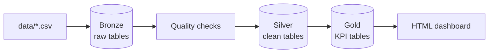

# Mini Data Platform — E-Commerce ETL Pipeline

A learning and portfolio project that implements a **Bronze → Silver → Gold** data pipeline for a fictional e-commerce store. Built following a hands-on junior Data/ETL developer roadmap.

**Stack:** Python 3.10 · PostgreSQL 17 · PySpark 3.5 · psycopg2

---

## What this project does

Raw CSV files (customers, products, orders, payments, shipments) are ingested into PostgreSQL, cleaned with business rules, and aggregated into KPI tables for reporting.



| Layer | Database | Purpose |
|-------|----------|---------|
| **Bronze** | `ecommerce_bronze` | Raw data as-is from CSV (including bad rows) |
| **Silver** | `ecommerce_silver` | Cleaned, validated, deduplicated data |
| **Gold** | `ecommerce_gold` | Business metrics (revenue, customer KPIs) |

---

## Features

- **Bronze ingest** — 5 CSV sources; orders ingested with **PySpark**
- **Bronze quality checks** — duplicate emails, negative prices, invalid quantity (SQL + Python)
- **Silver v2 transforms** — trim, dedupe, email normalization, FK validation, company vs individual rules
- **Rejected records** — bad rows stored in `silver.rejected_records` with reason codes
- **Gold KPIs** — daily sales and per-customer metrics
- **Pipeline orchestration** — `run_pipeline.py` runs the full flow end-to-end
- **Observability** — rotating logs, structured JSONL, metrics history, health checks, HTML dashboard, optional Slack alerts

---

## Project structure

```
mini-data-platform/
├── data/                 # CSV source files (generate with generate_test_data.py)
├── jobs/
│   ├── ingest_*.py       # Bronze ingest scripts
│   ├── bronze_data_checks.py
│   ├── transform_*.py    # Silver & Gold transforms
│   ├── run_silver_v2.py
│   ├── run_pipeline.py   # Main entry point
│   ├── health_check.py
│   └── generate_test_data.py
├── sql/
│   ├── bronze_setup.sql
│   ├── bronze_quality_checks.sql
│   ├── silver_v2_setup.sql
│   ├── gold_setup.sql
│   └── monitoring/
├── utils/
│   ├── db.py
│   ├── logging_config.py
│   ├── monitoring.py
│   └── transform_helpers.py
├── logs/                 # Runtime logs (gitignored)
└── reports/              # HTML dashboard (gitignored)
```

---

## Prerequisites

| Tool | Version | Notes |
|------|---------|-------|
| Python | 3.10+ | |
| PostgreSQL | 17 | Three databases required (see below) |
| Java | 11 | Required for PySpark |
| pgAdmin / DBeaver | any | Optional, for SQL exploration |

---

## Setup

### 1. Clone and install dependencies

```powershell
git clone <repo-url>
cd mini-data-platform
pip install -r requirements.txt
```

### 2. Create PostgreSQL databases

In pgAdmin or `psql`, create three databases:

- `ecommerce_bronze`
- `ecommerce_silver`
- `ecommerce_gold`

### 3. Run DDL scripts

Execute in pgAdmin (Query Tool), in order:

| Script | Database |
|--------|----------|
| `sql/bronze_setup.sql` | `ecommerce_bronze` |
| `sql/silver_v2_setup.sql` | `ecommerce_silver` |
| `sql/gold_setup.sql` | `ecommerce_gold` |

### 4. Configure environment

```powershell
$env:PGPASSWORD = 'your_password'
# Optional:
$env:SLACK_WEBHOOK_URL = 'https://hooks.slack.com/services/...'
```

See `.env.example` for all variables.

### 5. Generate test data

```powershell
python jobs/generate_test_data.py
```

Creates 5 CSV files with 10,000 rows each (~2% intentionally bad data).

---

## Usage

### Full pipeline

```powershell
python jobs/run_pipeline.py
```

Flow: **Bronze ingest → Bronze checks → Silver v2 → Gold → Health check → Dashboard**

### Individual commands

```powershell
python jobs/bronze_data_checks.py    # Bronze quality checks only
python jobs/health_check.py          # Post-run validation + dashboard
python jobs/run_silver_v2.py         # Silver layer only
python jobs/transform_gold.py        # Gold layer only
```

### Outputs

| Output | Location |
|--------|----------|
| Text logs | `logs/*.log` |
| Structured events | `logs/structured/*.jsonl` |
| Pipeline metrics | `logs/metrics/latest.json` |
| Monitoring dashboard | `reports/latest_dashboard.html` |

---

## Silver business rules (highlights)

**Customers**
- Email: trim, lowercase, dedupe by email
- Empty country → `Nepoznato`
- `individual`: name cannot be numeric-only; company-like names rejected unless `customer_type=company`
- `company`: must have `customer_type=company` in source CSV

**Orders / products / payments / shipments**
- Invalid FK references, negative amounts, bad status → rejected to `silver.rejected_records`

---

## Branching strategy

| Branch | Purpose |
|--------|---------|
| `main` | Empty — stable placeholder |
| `development` | Active development — full project |

---

## Roadmap coverage

This project implements all 44 steps from the junior ETL roadmap, including:

- PostgreSQL three-layer architecture
- CSV ingest (PySpark for orders)
- SQL data quality checks
- Silver cleaning and Gold KPIs
- Pipeline orchestration with logging
- Intentional failure / debug exercises

---

## License

MIT — free to use for learning and portfolio purposes.
